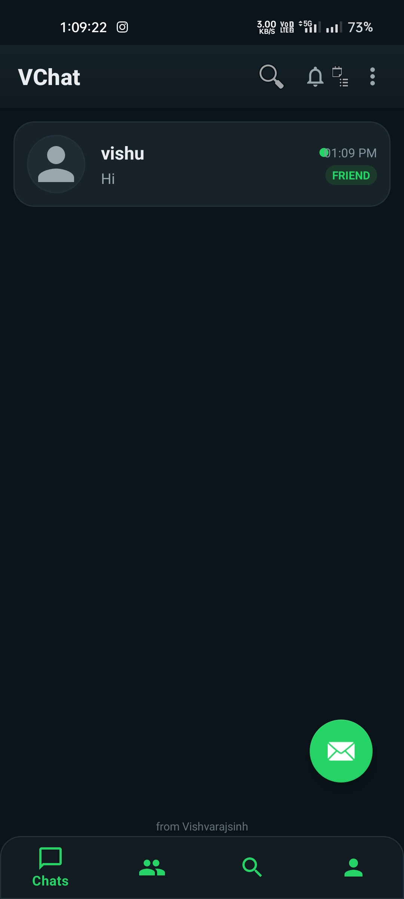
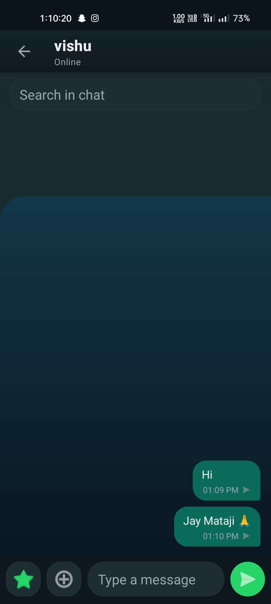
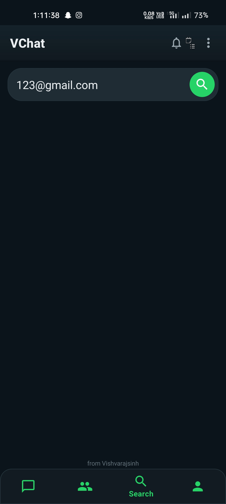

# VChat — Realtime Android Messaging Platform

Modern Firebase-powered realtime messaging application built with scalable architecture, advanced relationship systems, and production-style Android engineering.

---

## Live Portfolio

🌐 Portfolio Website:  
https://vlabs99.github.io/VLabs/

📦 Download APK:  
https://github.com/Vlabs99/Vchat/releases/download/v1.0/app-debug.apk

---

# Screenshots

## Splash Screen


## Chat Sessions


## Private Chat


## Group Settings


## Group Chat


## Profile


## User Search


---

# Core Features

## Messaging System
- Realtime messaging
- Direct one-to-one chats
- Group chats
- Reply to message
- Forward message
- Pinned messages
- Message pagination
- Realtime Firestore sync
- Typing indicator
- Realtime message updates

---

## Group System
- Group creation
- Add members to group
- Remove members from group
- Group admin messaging control
- Group system messages
- Group resurrection after new messages
- Group chat visibility restoration
- Hidden/deleted group recovery on new message

---

## Relationship System
- Friend requests
- Accept friend request
- Reject friend request
- Remove friend
- Block user
- Unblock user
- Friend-only messaging restrictions
- Relationship state management
- Pending request handling

---

## Chat Lifecycle System
- Delete chat for me
- Fresh chat reopen lifecycle
- Old hidden history isolation
- Restriction banners
- Composer visibility control

---

## Architecture Highlights

### Modular Manager / Helper Architecture
The project follows a modular scalable architecture using dedicated managers and controllers:

- ChatComposerController
- ReplyManager
- ForwardManager
- TypingManager

---

## Stability & Engineering

- Presence/online listener system
- Duplicate listener prevention
- Thread-safe UI updates
- Centralized restriction logic
- Firestore rules stabilization
- Mirrored relationship writes
- Persistent login session
- Logout flow handling

---

# Firebase Integration

- Firebase Authentication
- Firebase Firestore
- Firebase Storage
- Realtime Firestore listeners
- Cloud Functions notification groundwork

---

# Planned / Upcoming Features

- Firebase Cloud Messaging (FCM)
- Heads-up notifications
- Lockscreen notifications
- Media messaging
- Poll messages
- Event messages
- Contact sharing
- Sticker support
- Active chat anti-spam system

---

# Tech Stack

## Android
- Java
- Android Studio
- Material Design

## Backend & Cloud
- Firebase Authentication
- Firebase Firestore
- Firebase Storage
- Firebase Cloud Functions

## Architecture
- Modular Manager Architecture
- Realtime Listener System
- Lifecycle-aware UI management

---

# Local Development

```bash
npm install
npm run dev