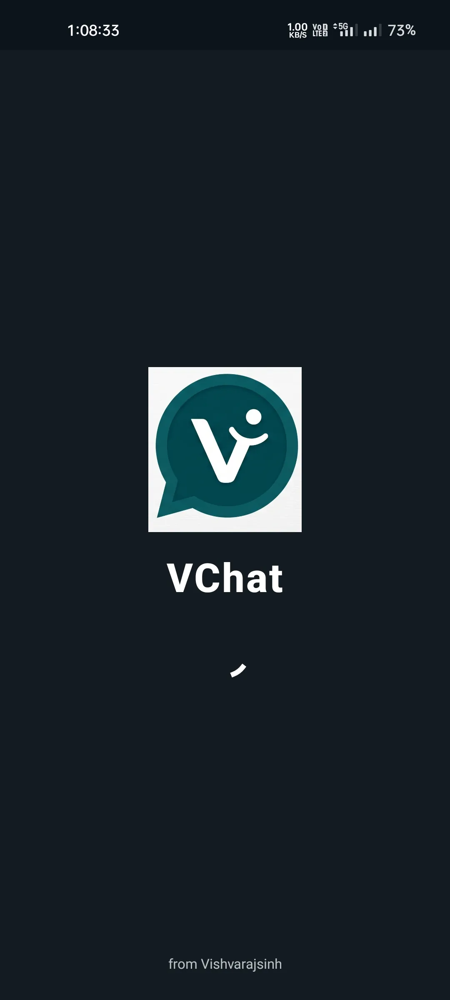
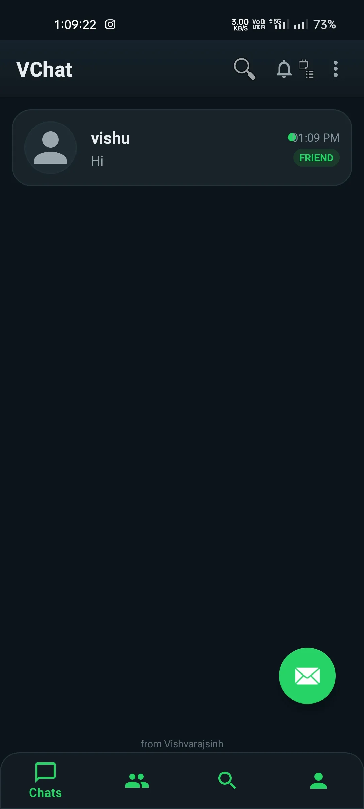
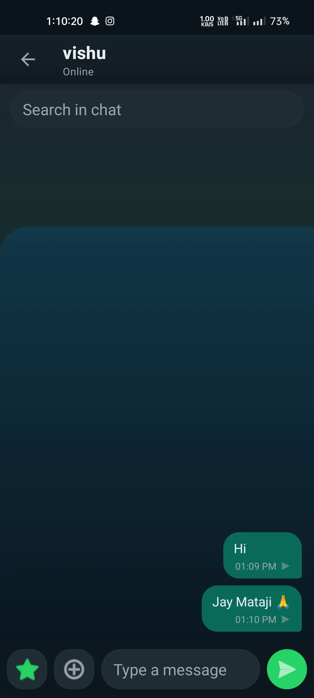
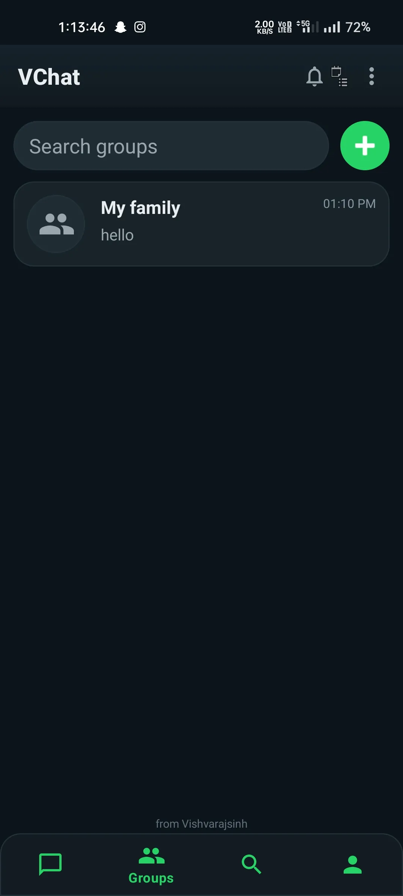
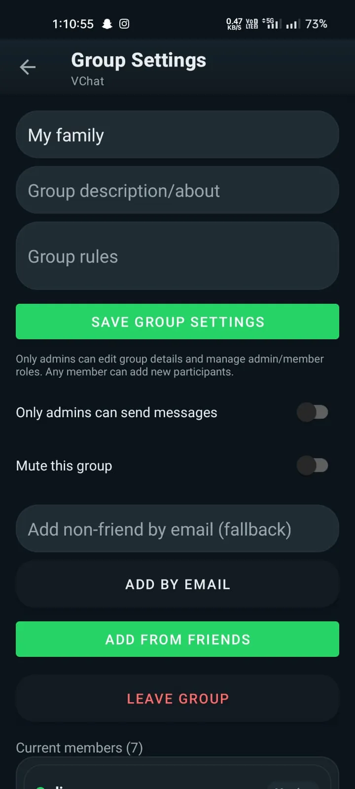
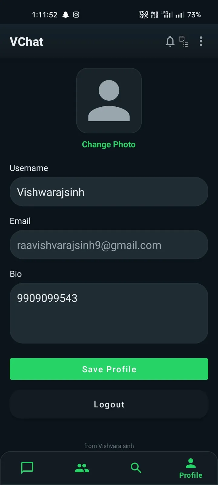
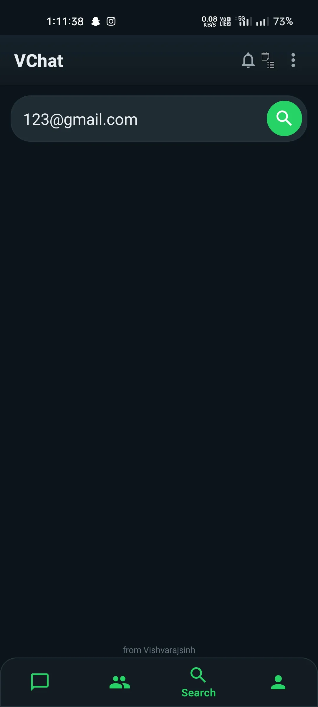

<div align="center">

# VLabs

Modern developer portfolio focusing on Android engineering, realtime systems, and UI/UX design.


</div>

---

## Live Demo

- **Portfolio URL**: [https://Vlabs99.github.io/VLabs/](https://Vlabs99.github.io/VLabs/)
- **VChat Web URL**: [https://v-chat-web.vercel.app/chat](https://v-chat-web.vercel.app/chat)

---

## About

VLabs is the professional developer portfolio of Vishwarajsinh Chudasama. It showcases expertise in building production-grade Android applications, developing realtime messaging architecture with Firebase, and creating modern, high-performance web interfaces using React and TypeScript. The portfolio itself is designed with a premium glassmorphism aesthetic, featuring dynamic animations and responsive layouts.

---

## Features

- [x] Responsive glassmorphism UI design
- [x] Dynamic particle background animations
- [x] Interactive project showcases
- [x] Dedicated VChat product landing page
- [x] Custom mobile-friendly navigation
- [x] High-performance rendering with Vite and React
- [x] Strict TypeScript integration for type safety

---

## Tech Stack

### Frontend
- React 18
- TypeScript
- Tailwind CSS
- Framer Motion

### Backend (VChat)
- Firebase Authentication
- Cloud Firestore
- Firebase Storage

### Tools
- Vite
- ESLint
- PostCSS
- Git

### Deployment
- GitHub Pages (Portfolio)
- Vercel (VChat Web)

---

## Featured Project: VChat

VChat is a modern real-time messaging platform inspired by leading chat applications. It bridges the gap between simple chat applications and robust enterprise messaging platforms.

- **Android**: Native Java implementation with MVVM architecture, lifecycle-safe components, and seamless UI.
- **Web**: React and TypeScript web client providing an Android-like experience across Desktop, Tablet, and Mobile.
- **Firebase**: Backend infrastructure utilizing Realtime Database for ephemeral states, Firestore for persistent data, and Cloud Storage for media.

**Repository**: [https://github.com/Vlabs99/VChat-Web](https://github.com/Vlabs99/VChat-Web)  
**Download APK**: [v1.0 app-debug.apk](https://github.com/Vlabs99/Vchat/releases/download/v1.0/app-debug.apk)

---

## Screenshots

<div align="center">
  
  
  
  
</div>
<div align="center">
  
  
  
</div>

---

## Installation

1. Clone the repository:
   ```bash
   git clone https://github.com/Vlabs99/VLabs.git
   ```
2. Navigate to the project directory:
   ```bash
   cd VLabs
   ```
3. Install dependencies:
   ```bash
   npm install
   ```

---

## Run Locally

Start the development server with Hot Module Replacement (HMR):

```bash
npm run dev
```

The application will be available at `http://localhost:5173`.

---

## Build

To create a production-ready build:

```bash
npm run build
```

The compiled assets will be generated in the `dist` directory. You can preview the production build locally using:

```bash
npm run preview
```

---

## Folder Structure

```text
VLabs/
├── public/                 # Static assets (images, screenshots)
├── src/
│   ├── assets/             # Application assets and styles
│   ├── components/         # Reusable React components
│   ├── pages/              # Route pages (Home, VChat, etc.)
│   ├── App.tsx             # Main application component
│   └── main.tsx            # Application entry point
├── package.json            # Project dependencies and scripts
├── tailwind.config.js      # Tailwind CSS configuration
├── tsconfig.json           # TypeScript configuration
└── vite.config.ts          # Vite configuration
```

---

## Future Roadmap

- [ ] End-to-End Encryption for VChat
- [ ] Voice & Video Calls integration
- [ ] Desktop Client (Electron) development
- [ ] Stickers & GIFs support in chat
- [ ] Portfolio performance optimizations
- [ ] Enhanced accessibility features

---

## Author

**Vishwarajsinh Chudasama**
- GitHub: [@Vlabs99](https://github.com/Vlabs99)
- Portfolio: [Vlabs99.github.io/VLabs](https://Vlabs99.github.io/VLabs/)

---

## License

This project is licensed under the [MIT License](LICENSE).
